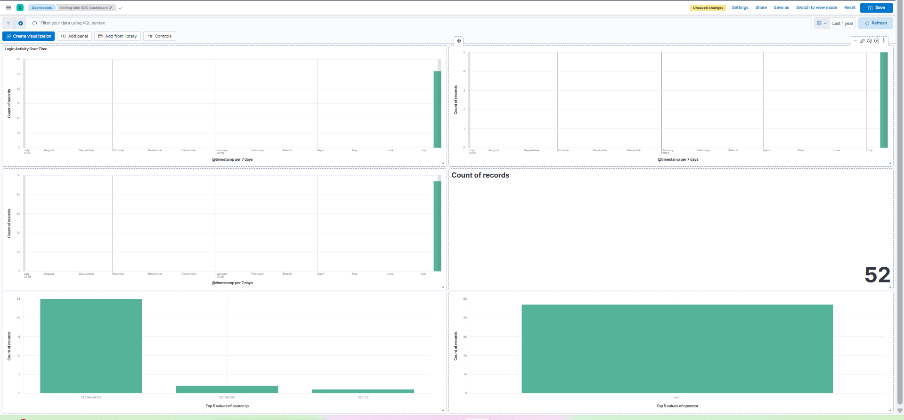

# Mini SOC using Elastic Stack

## Overview

This project demonstrates the design and implementation of a Mini Security Operations Center (SOC) using the Elastic Stack (ELK). It simulates real-world SOC workflows including centralized log collection, log parsing, dashboard creation, detection engineering, and security alert generation.

---

## Objectives

- Collect application logs centrally
- Parse raw logs using Grok Ingest Pipelines
- Visualize security events using Kibana Dashboards
- Detect suspicious activities using Elastic Security Rules
- Simulate SOC monitoring and incident detection

---

## Technologies Used

- Elasticsearch
- Kibana
- Elastic Agent
- Fleet Server
- Ingest Pipelines
- Grok Processor
- Elastic Security
- Ubuntu Server
- Kali Linux

---

## Features

✔ Centralized log collection

✔ Log parsing using Grok

✔ Login monitoring dashboard

✔ Failed login detection

✔ Source IP analysis

✔ Operator activity monitoring

✔ Custom detection rules

✔ Security alerts

---

## Detection Rules Implemented

- Failed Login Detection
- Multiple Failed Login Attempts
- Firmware Upload Detection
- USB Device Detection
- Network Scan Detection

---

## Dashboard Components

- Total Login Events
- Successful vs Failed Logins
- Failed Login Attempts by Operator
- Total Login Count

---

## Project Report

The complete project documentation is available in:

Mini-SOC-Elastic-Stack-Project-Report.pdf

---

## Screenshots

Example:

---

## Skills Demonstrated

- SIEM
- SOC Operations
- Log Analysis
- Detection Engineering
- Threat Monitoring
- Dashboard Development
- Incident Detection
- Security Documentation

---

## Author

**Abhinand V**

GitHub: https://github.com/Abhiabhinand008

LinkedIn: https://www.linkedin.com/in/abhinand-v00

GitBook: https://abhinand.gitbook.io/abhinand-docs

